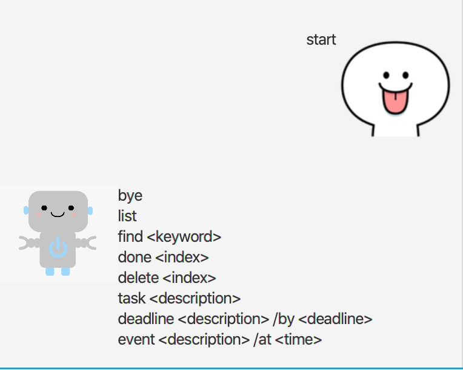
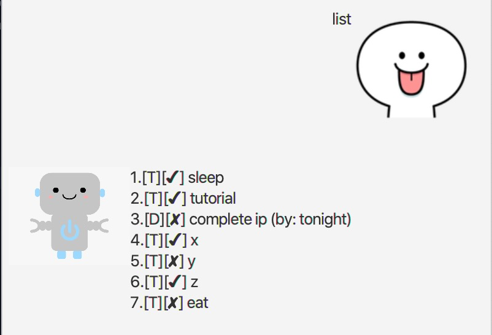
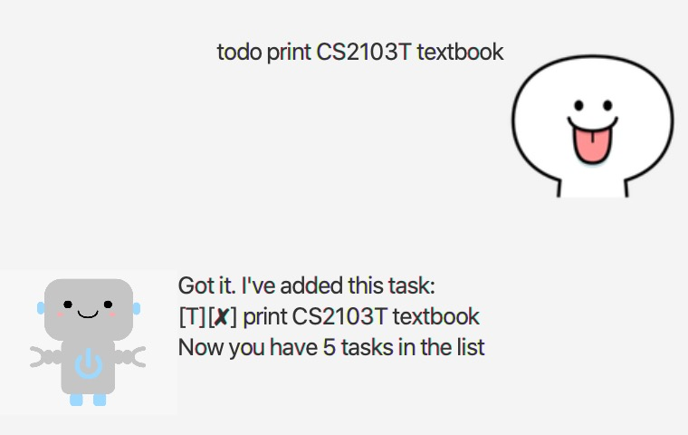
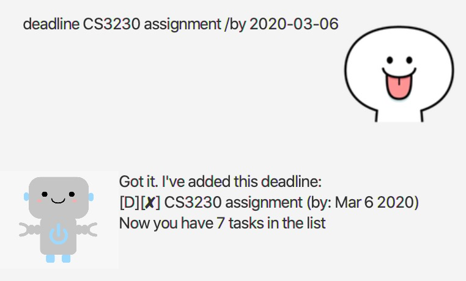
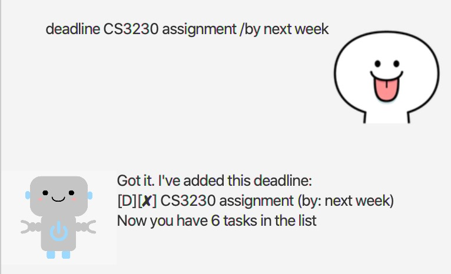
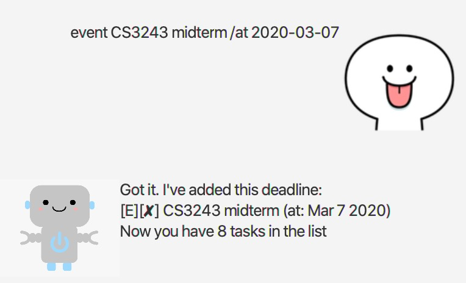
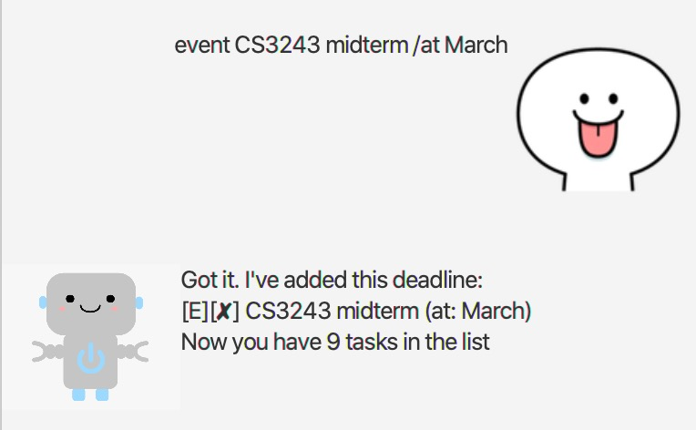
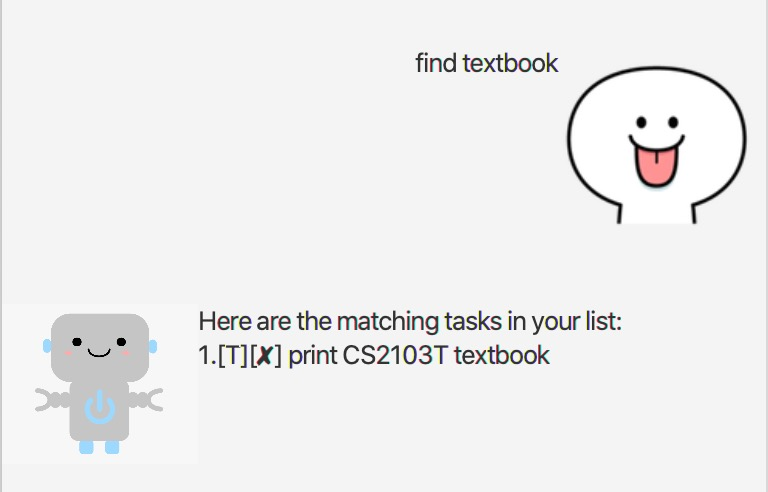
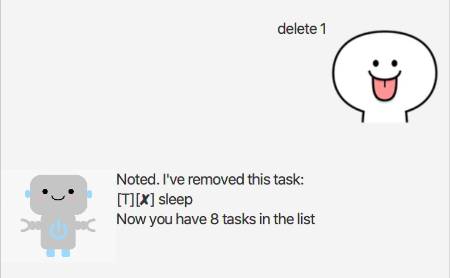
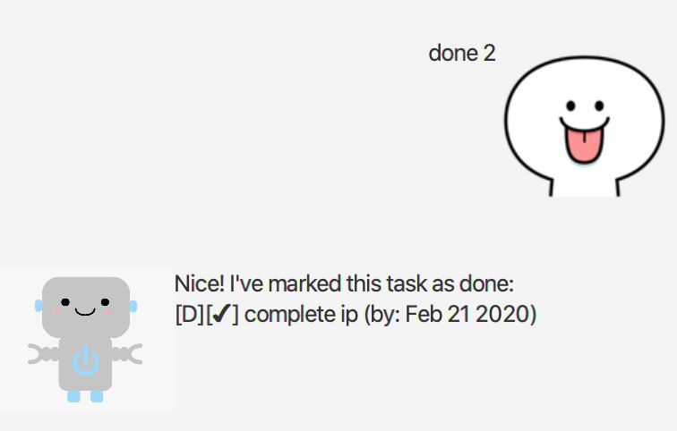

# User Guide

## Features 
* Create tasks
* Show tasks
* Delete tasks
* Set tasks as done
* Find tasks
* Save tasks
* Prevents duplicate tasks
* Exits Duke

### Feature 0: Learning to use duke
Duke is a personal chatbot assistant to help you manage your tasks.
For first time users, enter "start" for a tutorial.

### Feature 1 : Create tasks
Tasks can be further categorized into deadlines and events, 
each with a specific format. 

### Feature 2: Show tasks
To ease the user in deciding what to do, duke is able to show a series
of tasks created chronologically to the user. Each task is shown with its
description, the status of completion, and the time to complete if the task
is a deadline or an event.

### Feature 3: Delete tasks
Users are able to delete certain tasks after completion or the task
is no longer needed.

### Feature 4: Set tasks as done
After a user has finished a task, he will receive a congratulate message
from the duke, and the duke will update the task's status accordingly.

### Feature 5: Find tasks
Users may have a number of tasks which is relevant to a subject, and may 
have confusion of which task is needed for completion first. The duke is
able to filter tasks, and show relevant task based on the user input.

### Feature 6: Save tasks
Duke is also memorable. If the user has unfinished task, the duke will
record it and remind the user again the next time duke is called.

### Feature 7: Prevents duplicate task
To avoid having the same tasks in the list, duke is equipped with a 
detector such that he will warn the user if the user attempts to create
the exact same task.

### Feature 8: Clears tasks
If users haven't used duke for a while, and all the tasks are no longer 
invalid, the users can choose to clear all the tasks rather than 
delete them manually.

### Feature 9: Exits Duke
The duke will sent a goodbye message should the user requests to turn it
off.

## Usage

### `start` - Shows a list of valid commands.

The duke is able to show a list of valid commands for first time users.

Example of usage:

`start`

Expected outcome:

### `list` - Shows a list of current pending tasks.
 
The duke not only shows newly created tasks by the user in the current
session, but also loads previously uncompleted tasks.

Example of usage: 

`list`

Expected outcome:

### `todo <task description>` - Creates a new todo task.

A todo is a task which contains only the description, and its 
completion status.

Example of usage: 
`todo print CS2103T textbook`

Expected outcome:

### `deadline <deadline description> /by <deadline>` - Creates a new deadline.

A deadline is a task that needs to be done before the specified time.
The time can be in any valid time phrase, or a format with YYYY-MM-DD.

Example of usage:

`deadline CS3230 assignment /by 2020-03-06` or 

`deadline CS3230 assignment /by next week`

Expected outcome:

### `event <event description> /at <time>` - Creates a new event.

An event is a task that is taking place at the specified time. The time 
can be in any valid time phrase, or a format with YYYY-MM-DD.

Example of usage:

`event CS3243 midterm /at 2020=03-07` or 

`event CS3243 midterm /at March`

Expected outcome:

### `find <keyword>` - Locates all relevant tasks.

Users can filter tasks by selecting a keyword to search.

Example of usage:

`find textbook`

Expected outcome:

### `delete <index number of task to delete>` - Deletes the current task at that index.

Users can delete tasks after completing that task or that task's 
deadline is over.

Example of usage:

`delete 1`

Expected outcome:

### `done <index number of task to set done>` - Sets the task at that index to be completed.

Users can mark certain tasks as done upon completion.

Example of usage:

`done 2`

Expected outcome:

### `clear` - Clears all tasks.

Users can delete all their tasks.

Example of usage:

`clear`

Expected outcome:

Empties the list of task.

`bye`

Expected outcome:

Exits the application.

